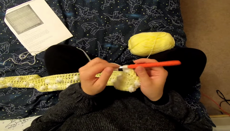
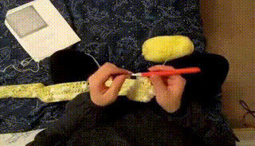
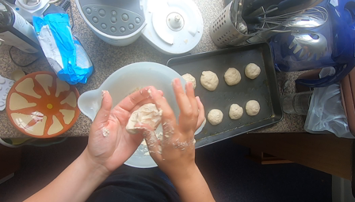
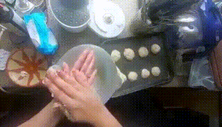
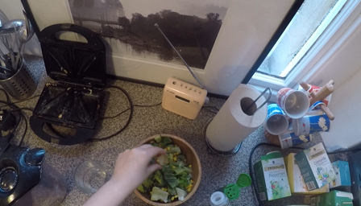
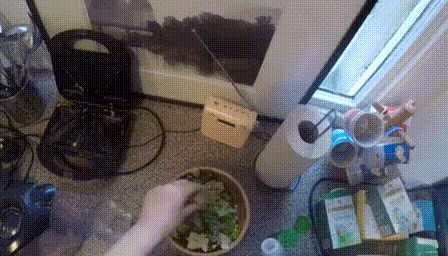
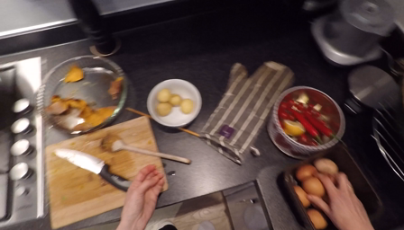
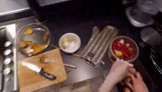
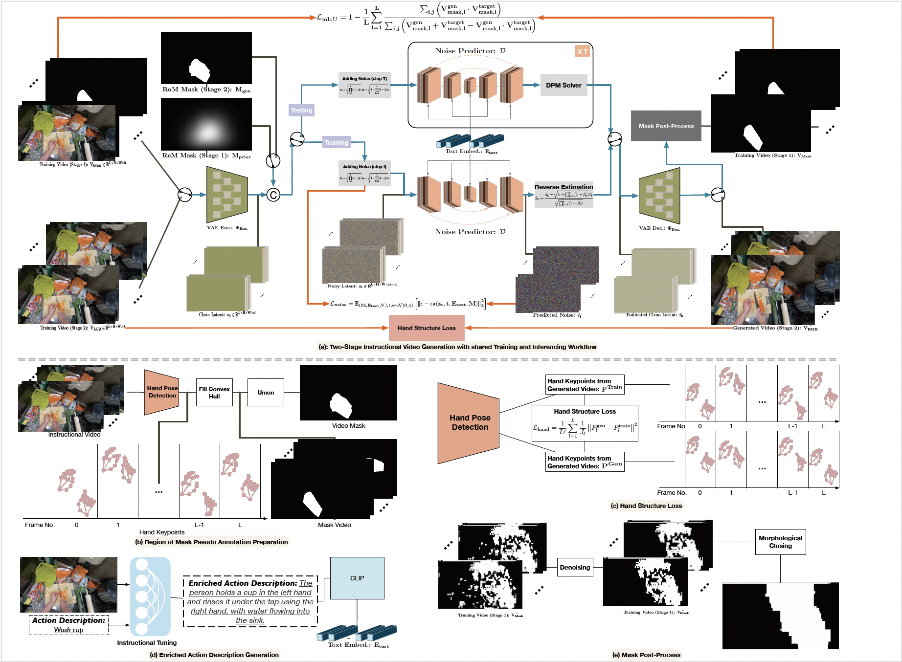
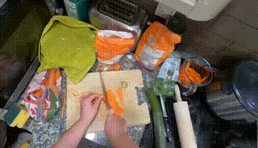

<div align="center">
  
# Instructional Video Generation

[Yayuan Li](https://www.linkedin.com/in/yayuan-li-148659272/), [Zhi Cao](zhicao@umich.edu), [Jason J. Corso](https://web.eecs.umich.edu/~jjcorso/)

[COG Research Group, University of Michigan](https://github.com/MichiganCOG)

<a href='https://arxiv.org/abs/2412.04189'></a> 
<a href='https://excitedbutter.github.io/project_page/'></a>
</div>


We aim to enhance instructional video generation with a diffusion-based framework, achieving state-of-the-art results in hand motion clarity and task-specific region localization. Visit [project page](https://excitedbutter.github.io/project_page/) for more video resutls. 

If you find our project helpful, please give it a star :star: or [cite](#bibtex) it, we would be very grateful :sparkling_heart: .


## Showcases
<table class="center">
  
  <tr>
    <td>Input image</td>
    <td>Result</td>
    <td>Input image</td>
    <td>Result</td>
  </tr>
  
  <tr>
    <td></td>
    <td></td>
    <td></td>
    <td></td>
  </tr>
  
  <tr>
    <td colspan="2" align="center"><strong><em>Action Description:</em></strong> Knit the fabric.</td>
    <td colspan="2" align="center"><strong><em>Action Description:</em></strong> Roll dough.</td>
  </tr>

  <tr>
    <td></td>
    <td></td>
    <td></td>
    <td></td>
  </tr>
  
  <tr>
    <td colspan="2" style="width:350;" align="center">
      <strong><em>Action Description:</em></strong> Pour vinegar into bowl.
    </td>
    <td colspan="2" style="width:550;" align="center">
      <strong><em>Action Description:</em></strong> Pick up and crack egg.
    </td>
  </tr>
  
</table>


## Framework


## News 🔥
**2024.12.9**: Released inference code and updated the model to instructional_video_v1.0

## Features Planned
- 💥 Release training code
- 💥 Video generatinon with camera movement.
- 💥 Support Huggingface Demo / Google Colab.
- etc.

## Getting Started
This repository is based on [animate-anything](https://github.com/alibaba/animate-anything).

### Create Conda Environment (Optional)
It is recommended to install Anaconda.

**Windows Installation:** https://docs.anaconda.com/anaconda/install/windows/

**Linux Installation:** https://docs.anaconda.com/anaconda/install/linux/

```bash
conda create -n IVG python=3.10
conda activate IVG
```

### Python Requirements
```bash
pip install -r requirements.txt
```
## 💥 Training / Fine-tuning

### Fine-tuning on EPIC-KITCHENS/EGO4D dataset
1. Download the EPIC-KITCHENS/EGO4D dataset.
2. Download the [pretrained model](https://cloudbook-public-production.oss-cn-shanghai.aliyuncs.com/animation/animate_anything_512_v1.02.tar) to output/latent.
3. Download the [region of motion mask](https://cloudbook-public-production.oss-cn-shanghai.aliyuncs.com/animation/animate_anything_512_v1.02.tar) and change `mask_path` under `VideoJsonDataset` class in `utils/dataset.py`.
4. In your config in `example/train_mask_motion.yaml`, make sure to set `dataset_types` to `video_json` and set `output_dir`, `output_dir`, `train_data:video_dir`, and `train_data:video_json` like this:
```
  - dataset_types: 
      - video_json
    train_data:
      video_dir: '/path/to/your/video_directory'
      video_json: '/path/to/your/json_file.json'
```
5. Run the following command to fine-tune. The following config requires around 30G GPU RAM. You can reduce the `train_batch_size`, `train_data.width`, `train_data.height`, and `n_sample_frames` in the config to reduce GPU RAM:
```
python train.py --config example/train_mask_motion.yaml pretrained_model_path=<download_model>
```

### Fine-tuning on your own dataset
1. Create your own dataset. Simply place the videos into a folder and create a json with captions like this:
```
[
      {"caption": "The person uses their left hand to pick up a plate with a piece of chicken on it.", "video": "1.mp4"}, 
      {"caption": "The person holds a plate with the left hand and places it down on the cupboard, while the right hand holds a paper.", "video": "2.mp4"}
]

```
2. Download the [pretrained model](https://cloudbook-public-production.oss-cn-shanghai.aliyuncs.com/animation/animate_anything_512_v1.02.tar) to output/latent.
3. Create your own region of motion mask by running following command:
```bash
python mask_video.py
```
4. Follow step 4 and step 5 in previous section.

## 💫 Inference
Please download the [pretrained model](https://drive.google.com/file/d/1sWlr5r54_XxqdgHoCacS7opoucABpEVx/view?usp=drive_link) to output/latent, then run the following command. Please replace the {download_model} to your download model name:
```bash
python train.py --config output/latent/{download_model}/config.yaml --eval validation_data.prompt_image=example/Julienne_carrot.png validation_data.prompt='The person holds a carrot on the chopping board with the left hand and uses a knife in the right hand to julienne the carrot.'
```

To control the motion area, we use the provided script `mask_video.py`. Update the input and output video folder paths as needed, and run the following command:
```bash
python mask_video.py
```

Below are examples of an input image and its corresponding RoM mask:

<p align="center">


</p>

Then run the following command for inference:
```bash
python train.py --config output/latent/{download_model}/config.yaml --eval validation_data.prompt_image=example/Julienne_carrot.png validation_data.prompt='The person holds a carrot on the chopping board with the left hand and uses a knife in the right hand to julienne the carrot.' validation_data.mask=example/carrot_mask.jpg 
```
<p align="center">  </p>


### Configuration

The configuration uses a YAML config borrowed from [Tune-A-Video](https://github.com/showlab/Tune-A-Video) repositories. 

All configuration details are placed in `example/train_mask_motion.yaml`. Each parameter has a definition for what it does.


## Bibtex
Please cite this paper if you find the code is useful for your research:
```
@misc{li2024instructionalvideogeneration,
      title={Instructional Video Generation}, 
      author={Yayuan Li and Zhi Cao and Jason J. Corso},
      year={2024},
      eprint={2412.04189},
      archivePrefix={arXiv},
      primaryClass={cs.CV},
      url={https://arxiv.org/abs/2412.04189}, 
}
```
